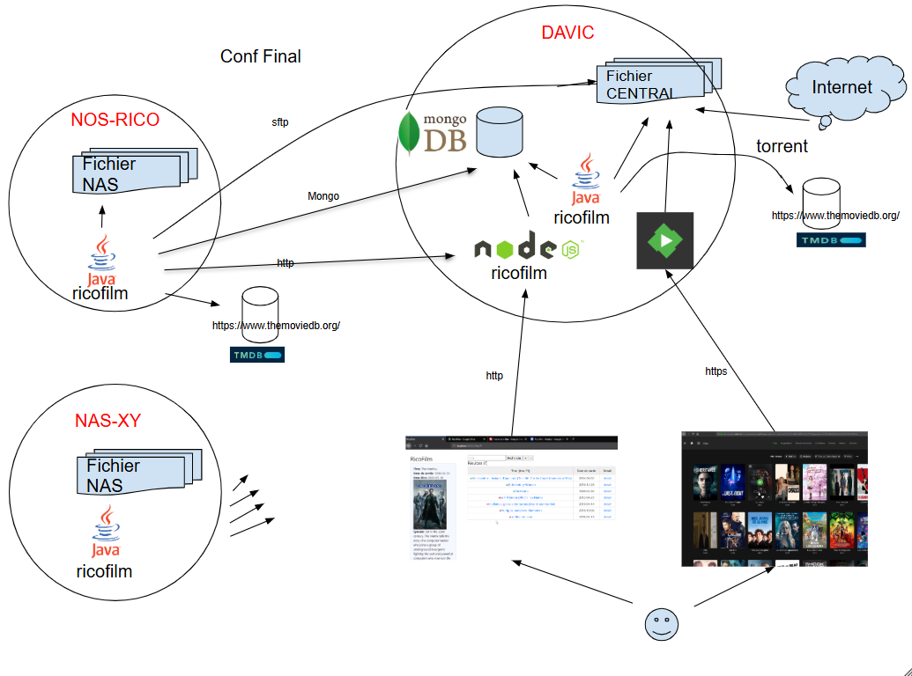

# Informations : 

Ricofilm permet de mettre en commun des dossiers de fichiers de film hébergés sur des nas différent et de remonter les film dans une base centralisée.
Les films de cette base sont exposés depuis un site Web.
Ce site web permet de consulter les films mais aussi de faire une demande de film issue d'un nas en particulier (une request) le film sera envoyé sur le serveur centralisé et dispo en streaming.

Ce programme : 
- Parse un dossier de fichier de films 
- Associe un film avec l'aide de la plateforme theMovieDb et reccuperer les infos detaillées du film
- Insere dans la base mongoDb les infos du films dans la collection films
- Ajoute à ces infos les informations du fichier (codec vidéo/son, sous titre .. ), extraction réalisée avec ffmpeg
- Envoi les film sur le serveur centralisé le film en de mande de streaming (request)

 # Architecture générale : 

# installation 
Installer OpenJDK 8

`sudo apt install openjdk-8-jdk`

Clone du code : 

`git clone https://github.com/ricohoho/ricofilm.git`

Installation de Mvn 

` sudo apt install maven`

# fichier de configuraiton 
`init.properties`

> #======== ACTION POSIBLE =========
> 
> ACTION1=DOWNLOAD_IMAGE
> 
> ACTION2=AJOUT_FILM
> 
> ACTION3=SUPPRIME_FILM
> 
> ACTION4=REQUEST_FILM
> 
> #========= SFTP ============
> 
> CENTRAL_SFTP_HOST=davic.mkdh.fr
> 
> CENTRAL_SFTP_PORT=4322
> 
> CENTRAL_SFTP_USER=ricohoho
> 
> CENTRAL_SFTP_SFTP_PASS=xxxxx
> 
> CENTRAL_SFTP_WORKINGDIR=/home/ricohoho/test
> 
> #======== HTTP RESQUEST=============
> 
> REQUEST_HTTP_HOST=localhost 
> 
> REQUEST_HTTP_PORT=3000
> 
> REQUEST_STATUS=AFAIRE
> 
> #======= Nom du serveur indiqué en BD des fichier film accessible
> 
> SERVEUR_NAME=POR80090940
> 
> PATH_FILM=/home/efassel/ricofilm/ricofilm/dir-films/
> 
> PATH_FILM_NIV_SSDOSSIER=1
> 
> #======= Mogodob ================
> 
> MONGODB_HOST=localhost
> 
> MONGODB_PORT=27017
> 
> MONGODB_NAME=ricofilm
> 
> MONGODB_USER=ricohoho
> 
> MONGODB_PWD=xxxx

# Compile : création du jar ou execution 
**creation du package :**
RicoFilm2-0.0.1-SNAPSHOT-jar-with-dependencies.jar

` mvn package`

**execution je l'application : (en maven sans jar)**

` mvn exec:java -Dexec.mainClass="ricohoho.themoviedb.RicoFilm"`

**execution je l'application : (avec le jar jar)**

` java -jar Ricofilm action path`

**LEs paramètres :** 
patch : /home/efassel/ricofilm/ricofilm/dir-films/
action : 
Les parametres d'action possibles sont :
**DOWNLOAD_IMAGE**  => provoque le teechargment de l'image des fichier film dans le dossier :/home/efassel/ricofilm/ricofilm/dir-films/

**AJOUT_FILM**                    => provoque l'ajout dans la base Ricofilms des fichiers du dossier :/home/efassel/ricofilm/ricofilm/dir-films/

**AJOUT_FILM_SANS_IMAGE**    => provoque l'ajout dans la base Ricofilms, sans l'image affiche,  des fichiers du dossier :/home/efassel/ricofilm/ricofilm/dir-films/

**SUPPRIME_FILM**                   => provoque la suppression dans le base des Ricofilms n'etant plus dans le dossier :/home/efassel/ricofilm/ricofilm/dir-films/

**MAJ_FILM**                        => provoque la MAJ des films : ajout + supprime dans le base dans le dossier :/home/efassel/ricofilm/ricofilm/dir-films/

**MAJ_FILM_SANS_IMAGE**      => provoque la MAJ des films : ajout + supprime dans le base dans le dossier :/home/efassel/ricofilm/ricofilm/dir-films/

**REQUEST_FILM**                    => interoge la base ricofilms afin de savoir si un fichier de votre serveur a ete demande et si oui l'envoi !